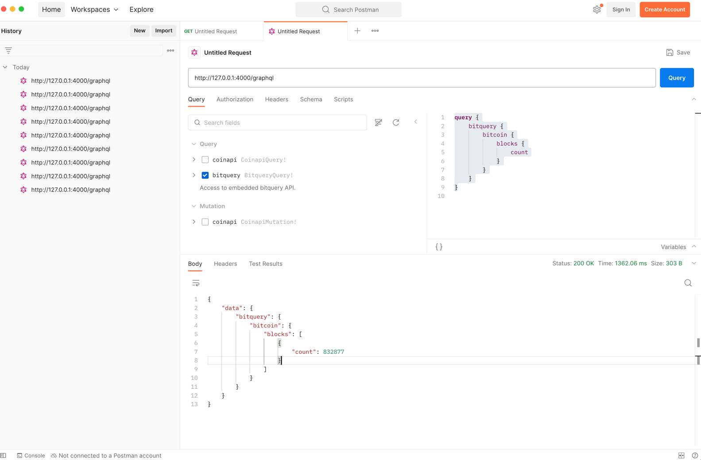

# Bitcoin Grafbase

* Install the latest LTS version of Nodejs.
* Clone this repository: `git clone git@github.com:neu-info7500-spring-04/bitcoin-grafbase.git`
* Copy the `.env.example` file and name it `.env`. 
* Update your `.env` file with your own API keys for the endpoints.
* In the `bitcoin-grafbase` directory, execute:

```
npm install
npx grafbase dev
```

The gateway should be at http://127.0.0.1:4000/graphql.

Use [Postman](https://www.postman.com/) to try the following query on the gateway.
This query invokes the bitquery subgraph. 
```graphql
query {
    bitquery {
        bitcoin {
            blocks {
                count
            }
        }
    }
}
```
The postman view should look like:



